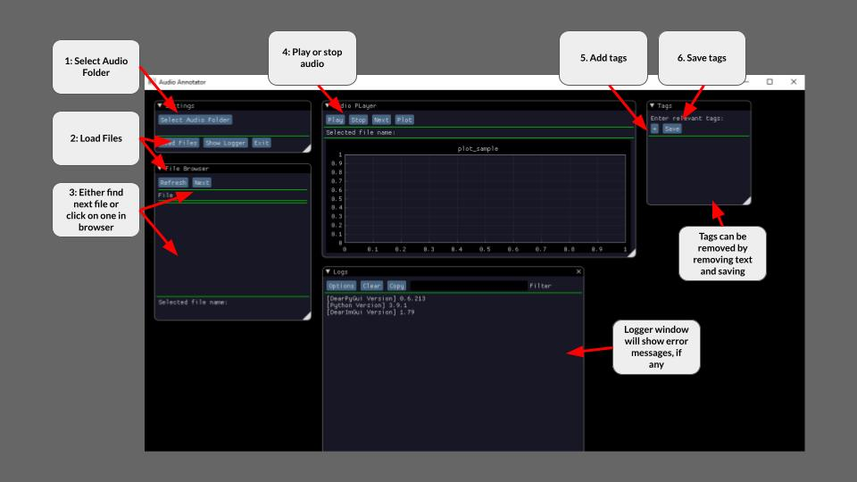

# Audio Annotator

A (hopefully) simple to use audio annotator which can:
1. Load wav files from a directory
2. Display the wav files in a browser
3. Play or stop the wav files as well display an audio sample plot
4. Add or remove tags
5. Save annotation files on disk

# Installation / Setup

Easy way is to use the [exe](executable/AudioAnnotator.zip) file directly. Please let me know if anyone needs a binary for Mac or Linux as well.

You can also run the python script instead but will need to setup your environment first:

1. Make sure you have `python 3.6` or above installed along with `pip`
2. (Optional) Install virtualenv `python -m pip install virtualenv`
3. (Optional) Create a virtual environment `python -m virtualenv venv`
4. (Optional) Activate the environment `venv\Scripts\Activate`
5. Install required packages `python -m pip install -r requirements.txt`
6. Run the main script `python main.py`

# UI Components

